# Bonsai vs Qwen3.5, on Edge

> **Note:** This benchmark is a quick experiment to compare these models on a Jetson Orin, not a thorough or rigorous evaluation. Take the results as rough directional signals, not definitive rankings.

> **Fairness note on Ternary-Bonsai speeds:** the `mlx-2bit` Ternary-Bonsai models (1.7B / 4B / 8B) are designed for Apple Silicon. To compare them head-to-head with the llama.cpp models on the same hardware, we ported them to run on Jetson CUDA (source build of MLX with sm_87 kernels). **The tok/s numbers reported here for those three MLX Ternary-Bonsai models are Jetson-MLX-CUDA numbers, not what you'd see on an M-series Mac or iPhone.** Per the model cards, the same weights run at ~30 tok/s on M4 Pro and ~100 tok/s on iPhone 17 Pro Max — several times faster than our Jetson port. Accuracy is intrinsic to the weights and is unaffected. **The two new 27B models are GGUF and run natively on llama.cpp CUDA**, so their tok/s are real llama.cpp GPU numbers (no MLX caveat).

How good is the world's first 1-bit LLM, and can we stretch the same idea all the way up to 27B? We pit [Bonsai-8B](https://prismml.com/news/bonsai-8b) (1-bit, llama.cpp Q1_0), the two new **27B Bonsai models** (Bonsai-27B 1-bit `Q1_0` and Ternary-Bonsai-27B `Q2_0` ternary, both GGUF on llama.cpp CUDA), and the [Ternary-Bonsai collection](https://huggingface.co/collections/prism-ml/ternary-bonsai) (1.7B / 4B / 8B, 1.58-bit ternary weights served via MLX-CUDA) against six Qwen3.5 variants (0.8B–27B) on an NVIDIA Jetson Orin. All 12 models answer the same 98 questions across 7 categories.

## About the Bonsai family

[Bonsai-8B](https://prismml.com/news/bonsai-8b) is the world's first commercially viable 1-bit LLM, developed by [PrismML](https://prismml.com/) — a startup that emerged from Caltech research with backing from Khosla Ventures, Cerberus, and Google. The entire network (embeddings, attention, MLP, LM head) is natively 1-bit, resulting in a 1.1 GiB model that is 14x smaller and 8x faster than a full-precision 8B model. It is released under the Apache 2.0 license.

The **Ternary-Bonsai** collection is a follow-up set of Apple-Silicon-first models packaged as `mlx-2bit` — their weights are ternary (values in {−1, 0, +1}, ~1.58 bits/weight) with 2.125 bits/weight effective storage in the MLX format. We run them on the Jetson's CUDA GPU via a source build of MLX with sm_87 kernels, served through a minimal OpenAI-compatible wrapper (`mlx_openai_server.py`).

The two newest additions are **27B GGUF models** built on a larger (Qwen3.5-27B-class, arch `qwen35`) hybrid-attention backbone (~75% linear / 25% full attention, SwiGLU, RoPE, RMSNorm), ~27.3B parameters. Both are natively multimodal, but we benchmark text-only (the vision tower / `mmproj` is never loaded):

- **Bonsai-27B** is the 1-bit member (`Q1_0`, ~1.1 bits/weight, 3.8 GB). Q1_0 has since been **upstreamed into mainline llama.cpp** and runs on the Jetson GPU with a stock build — no fork required.
- **Ternary-Bonsai-27B** is the ternary member (`Q2_0`, ~2.1 bits/weight effective, 7.2 GB). Upstream llama.cpp ships a group-64 `Q2_0` (CPU/Metal only); Prism's **group-128 `Q2_0` CUDA kernels live in the [PrismML fork](https://github.com/PrismML-Eng/llama.cpp)**, so we serve the `Q2_0_g128` file through the fork to run it on the GPU.

The benchmark measures two things at once: how these aggressively-quantized Bonsai models fare against Qwen3.5's conventional Q4_K_M / Q4_K_S quantization, **and** how well the various low-bit runtimes (llama.cpp Q1_0/Q2_0, MLX-CUDA) perform on Jetson-class edge hardware.

## Models

| Model | Params | Quant | Runtime | Architecture | Weight Size |
|-------|-------:|-------|---------|--------------|------------:|
| **Qwen3.5-35B-A3B** | 35.5 B (3B active) | Q4_K_M | llama.cpp | MoE Hybrid SSM + Attention | 20.5 GiB |
| **Ternary-Bonsai-27B** | 27.3 B | Q2_0 (ternary, g128) | llama.cpp (PrismML fork, CUDA) | Hybrid Attention (Qwen3.5-27B 1.58-bit) | 6.7 GiB |
| **Bonsai-27B** | 27.3 B | Q1_0 | llama.cpp (upstream, CUDA) | Hybrid Attention (Qwen3.5-27B 1-bit) | 3.5 GiB |
| **Qwen3.5-27B** | 26.9 B | Q4_K_M | llama.cpp | Hybrid SSM + SWA + Full Attention | 15.6 GiB |
| **Qwen3.5-9B** | 8.95 B | Q4_K_M | llama.cpp | Hybrid SSM + Attention | 5.3 GiB |
| **Bonsai-8B** | 8.19 B | Q1_0 | llama.cpp | Dense Transformer (Qwen3-8B 1-bit) | 1.1 GiB |
| **Ternary-Bonsai-8B** | 8.19 B | mlx-2bit (ternary) | MLX-CUDA | Dense Transformer (Qwen3-8B 1.58-bit) | 2.1 GiB |
| **Qwen3.5-4B** | 4.21 B | Q4_K_M | llama.cpp | Hybrid Gated DeltaNet + Attention | 2.6 GiB |
| **Ternary-Bonsai-4B** | 4.02 B | mlx-2bit (ternary) | MLX-CUDA | Dense Transformer (Qwen3-4B 1.58-bit) | 1.1 GiB |
| **Qwen3.5-2B** | 1.89 B | Q4_K_M | llama.cpp | Hybrid Gated DeltaNet + Attention | 1.2 GiB |
| **Ternary-Bonsai-1.7B** | 1.72 B | mlx-2bit (ternary) | MLX-CUDA | Dense Transformer (Qwen3-1.7B 1.58-bit) | 462 MiB |
| **Qwen3.5-0.8B** | 0.82 B | Q4_K_S | llama.cpp | Hybrid Gated DeltaNet + Attention | 485 MiB |

The Qwen3.5, Bonsai-8B, and both 27B Bonsai models are served via `llama-server` behind systemd units with flash attention enabled and thinking/reasoning disabled (the 27B Bonsai models default to a thinking mode, which we switch off with `enable_thinking:false` + `--reasoning off` so they answer directly within the benchmark's token budgets — consistent with how the other Bonsai models run). The three smaller Ternary-Bonsai models are served by a minimal MLX-CUDA OpenAI-compatible server (`mlx_openai_server.py`), also wired into systemd so the benchmark swaps them in and out the same way.

Per-model server configs:
[Qwen3.5-27B](qwen3.5-27b-server.md) | [Qwen3.5-9B](qwen3.5-9b-server.md) | [Qwen3.5-4B](qwen3.5-4b-server.md) | [Bonsai-8B](bonsai-8b-server.md). The two 27B systemd units are `llama-server-bonsai-27b.service` and `llama-server-ternary-bonsai-27b.service`; see [Running the 27B GGUF models](#running-the-27b-gguf-models) for their configs.

## Benchmark Design

**98 questions** across **7 categories** and **3 difficulty levels** (easy / medium / hard):

| Category | Questions | Scoring |
|----------|:---------:|---------|
| General Knowledge | 14 | Exact match, keyword |
| Mathematics | 14 | Exact match |
| Coding | 14 | Execution-graded (Python test harnesses) |
| History | 14 | Exact match, keyword |
| Logical Reasoning | 14 | Exact match, constraint verifiers |
| Language Understanding | 14 | Exact match, keyword |
| Persian | 14 | Exact match, keyword |

Each question is run **3 times** per model. Scores report the mean across runs. Coding questions are graded by executing the model's output against a test suite (partial credit for passing some tests).

**Scripts:**
- `llm_benchmark.py` — runs the benchmark (manages systemd services, queries models, scores responses)
- `benchmark_eda.py` — generates analysis plots from the CSV results

## Results

**Dates:** 2026-04-01 (llama.cpp models) · 2026-04-17 (Ternary-Bonsai MLX-CUDA) · 2026-07-14 (Bonsai-27B & Ternary-Bonsai-27B, llama.cpp CUDA) | **Device:** Jetson Orin 30 GB

### Summary

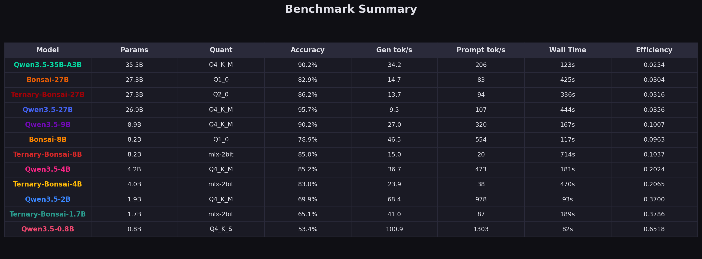

| Model | Accuracy | Gen tok/s | Prompt tok/s | Wall Time |
|-------|:--------:|:---------:|:------------:|:---------:|
| Qwen3.5-27B | **95.7%** | 9.5 | 107 | 444s |
| Qwen3.5-35B-A3B | 90.2% | 34.2 | 206 | 123s |
| Qwen3.5-9B | 90.2% | 27.0 | 320 | 167s |
| **Ternary-Bonsai-27B** | **86.2%** | 13.7 | 94 | 336s |
| Qwen3.5-4B | 85.2% | 36.7 | 473 | 181s |
| Ternary-Bonsai-8B | 85.0% | 15.0 | 20 | 714s |
| Ternary-Bonsai-4B | 83.0% | 23.9 | 38 | 470s |
| **Bonsai-27B** | **82.9%** | 14.7 | 83 | 425s |
| Bonsai-8B | 78.9% | 46.5 | 554 | 117s |
| Qwen3.5-2B | 69.9% | 68.4 | 978 | 93s |
| Ternary-Bonsai-1.7B | 65.1% | 41.0 | 87 | 189s |
| Qwen3.5-0.8B | 53.4% | **100.9** | **1303** | **82s** |

### Overall Accuracy

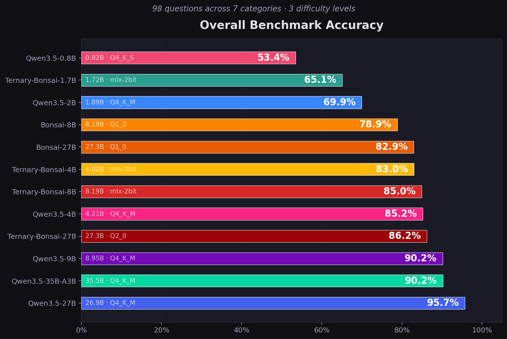

Qwen3.5-27B still leads at 95.7%. The 35B-A3B MoE ties the dense 9B at 90.2%. The new **Ternary-Bonsai-27B lands at 86.2%** — the highest of the entire Bonsai family, edging past Ternary-Bonsai-8B (85.0%) and the dense Qwen3.5-4B (85.2%), though it doesn't close the gap to the ≥90% Qwen tier. The 1-bit **Bonsai-27B (82.9%)** beats the 1-bit Bonsai-8B (78.9%) by four points but lands *below* the 8B ternary model — at this scale, going ternary (2 bits) buys more accuracy than going 1-bit-but-bigger. **Ternary-Bonsai-8B (85.0%)** remains six points above the original Bonsai-8B and level with Qwen3.5-4B despite half the weight storage. **Ternary-Bonsai-4B (83.0%)** sits just under its Qwen counterpart with 40 % of the weight file. The smallest variant, **Ternary-Bonsai-1.7B (65.1%)**, slots between Qwen3.5-2B (69.9%) and Qwen3.5-0.8B (53.4%) — respectable given its 462 MiB footprint.

The clearest cross-scale signal: within the Bonsai family, **ternary > 1-bit at every size that has both** (8B: 85.0% vs 78.9%; 27B: 86.2% vs 82.9%), and the ternary curve flattens hard above 8B — the 27B ternary adds only 1.2 points over the 8B ternary. Most of what a bigger backbone buys back is the categories 1-bit quantization damages most (see Persian and math below).

### Accuracy per GiB

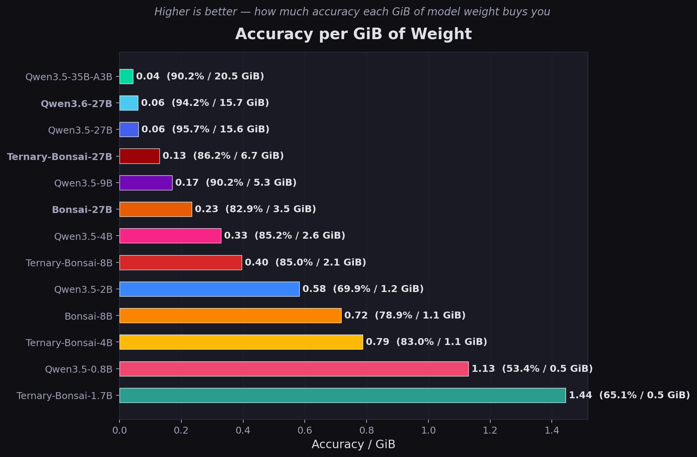

Weight-normalized, the small footprints dominate. Ternary-Bonsai-1.7B is the leader at **1.44 accuracy/GiB** (0.65 / 0.451 GiB), edging out Qwen3.5-0.8B (1.13). Ternary-Bonsai-4B (0.79) beats the Qwen3.5-4B it targets. Bonsai-8B's Q1_0 (0.72) and Ternary-Bonsai-8B's mlx-2bit (0.40) both stay ahead of all 5 GiB+ models. The two new **27B models are the accuracy-per-byte laggards** — Bonsai-27B at 0.23 (0.829 / 3.5 GiB) and Ternary-Bonsai-27B at 0.13 (0.862 / 6.7 GiB) — because a 27B backbone is a big file regardless of how few bits each weight uses. They still beat the dense Qwen3.5-27B (0.061) and 35B-A3B (0.044) per byte, but the message is unchanged: **the Bonsai efficiency story lives at the small end**; the 27B models are the "maximum-accuracy Bonsai" play, not the "accuracy-per-byte" play.

### Accuracy by Category

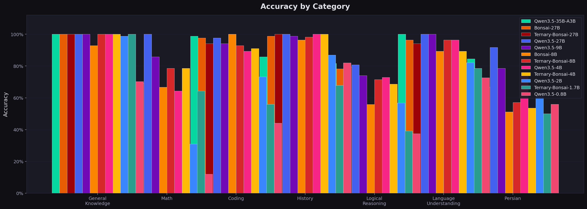

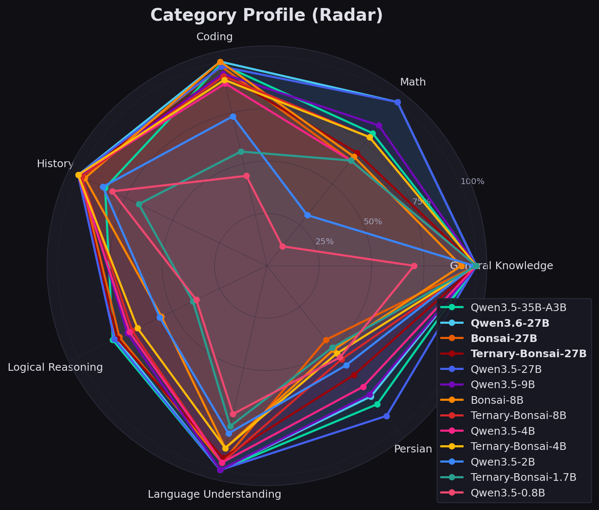

**Strong across larger models:** General Knowledge, Coding, History, Language Understanding.

**Biggest differentiators:**
- **Math** — still the widest spread. Qwen3.5-27B hits 100%; Ternary-Bonsai-27B reaches 69.0% and Bonsai-27B 64.3% — both *below* the Ternary-Bonsai 4B/8B (78.6%), showing that arithmetic under Q1_0/Q2_0 does not simply improve with backbone size. The 1.7B manages 64.3% — higher than Qwen3.5-2B's 31% — suggesting ternary quant preserves arithmetic better than the aggressive DeltaNet-hybrid compression at the 2B scale.
- **Logical Reasoning** — hardest category for every model. Both 27B Bonsai models cluster at ~79% (Ternary 79.5%, 1-bit 78.2%), a notch above Ternary-Bonsai-8B (71.4%) and roughly level with Qwen3.5-27B (80.8%). The 1.7B stays at 39.2%, below the 0.8B→2B band.
- **Persian** — Qwen3.5-27B (91.7%) remains dominant. This is where ternary vs 1-bit splits hardest at 27B: **Ternary-Bonsai-27B scores 66.7% but Bonsai-27B only 45.2%** — a 21-point gap, and Bonsai-27B is the *worst* Bonsai model on Persian. Multilingual knowledge is the first thing 1-bit quantization destroys, and a bigger backbone doesn't rescue it; ternary weights clearly retain far more of it.
- **Coding** — robust across the top: Bonsai-27B 97.6% and Bonsai-8B 100% (Q1_0 stays remarkably strong on code), Ternary-Bonsai-27B 94.0%, Ternary-Bonsai-8B 92.9%, 4B 91.1%. The 1.7B drops to 56%. Code generation survives extreme quantization down to ~4B, then falls off fast.
- **General Knowledge** — both 27B models and all three MLX Ternary models score **100%** on the 14-question GK set, matching Qwen3.5-27B / 9B / 4B. Factual recall survives even 1-bit quantization at 27B essentially intact.
- **History** — Ternary-Bonsai-27B is one of only a handful of models to hit **100%**; Bonsai-27B is right behind at 98.8%.

### Accuracy by Difficulty

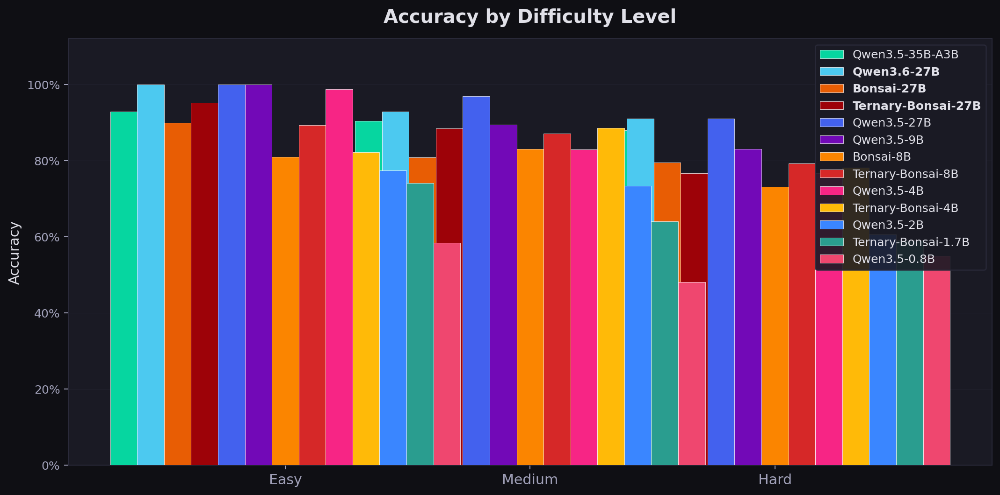

Top models handle easy questions (>90%). Ternary-Bonsai-27B tracks the Qwen tier on easy/medium (95.2% / 88.4%) but slides to 76.7% on hard — the ternary model's edge over the 1-bit model is concentrated in easy/medium factual and multilingual tasks, not hard reasoning. Bonsai-27B is flatter across difficulty (89.9% / 80.8% / 79.5%) and actually edges the ternary model on the hard slice. Elsewhere: Qwen3.5-27B stays above 90% on hard, Ternary-Bonsai-8B and -4B hover near 75%, Bonsai-8B drops to ~73%, and the 0.8B / 1.7B fall to ~55%.

### Accuracy vs. Speed

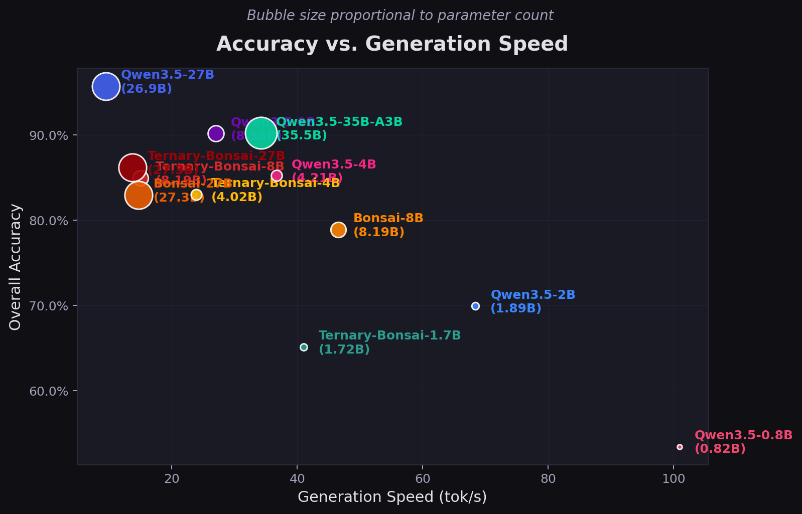

The Ternary-Bonsai family shifts the Pareto frontier along the **accuracy axis**, not the throughput axis — on this Jetson with this MLX-CUDA build, they sit vertically under their Qwen counterparts rather than to the right of them. Ternary-Bonsai-8B matches Qwen3.5-4B in accuracy but generates at 15 tok/s vs. 36.7 tok/s; Ternary-Bonsai-4B trades roughly half the speed of Qwen3.5-4B for a similar score. For the MLX models this is an **implementation caveat, not a model property** — the same ternary weights on an M-series Mac run at 50–100+ tok/s.

The two 27B Bonsai models sit at the **top-left** of the plot: high accuracy for the Bonsai family (82.9% / 86.2%) but the slowest generation of any GPU llama.cpp model here (~14 tok/s), simply because a 27B backbone moves 3–4× more weight per token than the 8B. Unlike the MLX models, these tok/s are honest llama.cpp CUDA numbers — the g128 `Q2_0` CUDA kernels in the PrismML fork give the ternary 27B a genuine GPU path (13.7 gen / 94 prompt tok/s), and Bonsai-27B's upstreamed `Q1_0` runs at 14.7 gen / 83 prompt tok/s. They advance the accuracy ceiling of the family, not its throughput frontier.

### Speed Comparison

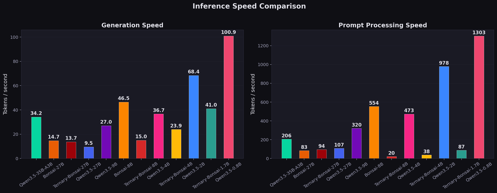

The llama.cpp models still follow the memory-bandwidth rule: smaller footprint → faster gen. Bonsai-8B's 1.1 GiB Q1_0 tops the chart at 46.5 tok/s; the 3.5 GiB Bonsai-27B and 6.7 GiB Ternary-Bonsai-27B land at ~14 tok/s — right where a 27B, 3–4× the weight of the 8B, should sit on a 205 GB/s bus. Notably, the 27B ternary's **llama.cpp prompt processing (94 tok/s) beats the MLX Ternary-Bonsai-8B's (20 tok/s)** despite being a bigger model, because llama.cpp's CUDA prefill is far more mature than our MLX-CUDA build. The MLX-CUDA Ternary-Bonsai models slot into the 15–41 tok/s gen band — decent for the Jetson's memory, but their prompt processing (20–87 tok/s) is the bottleneck: that's why Ternary-Bonsai-8B's full run takes 714 s while Ternary-Bonsai-27B (a *larger* model, but on llama.cpp) finishes in 336 s. Runtime maturity, not model size, dominates prefill cost here.

### Performance Details

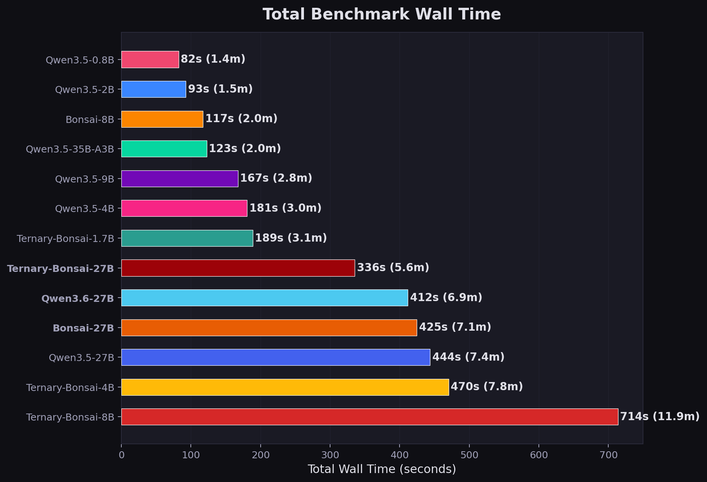

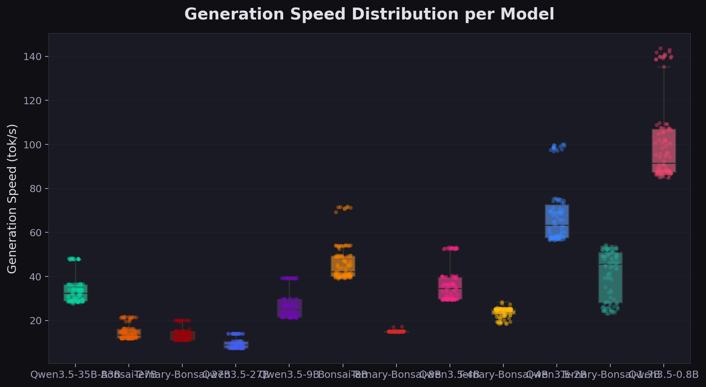

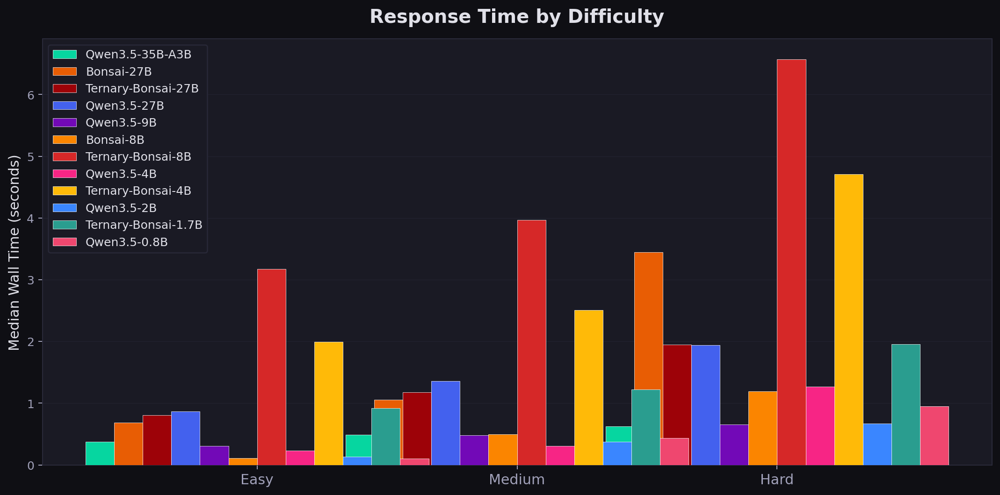

### Scaling Analysis

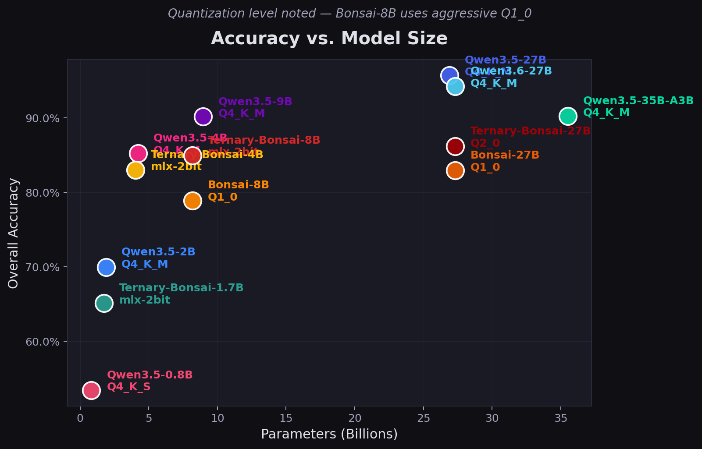

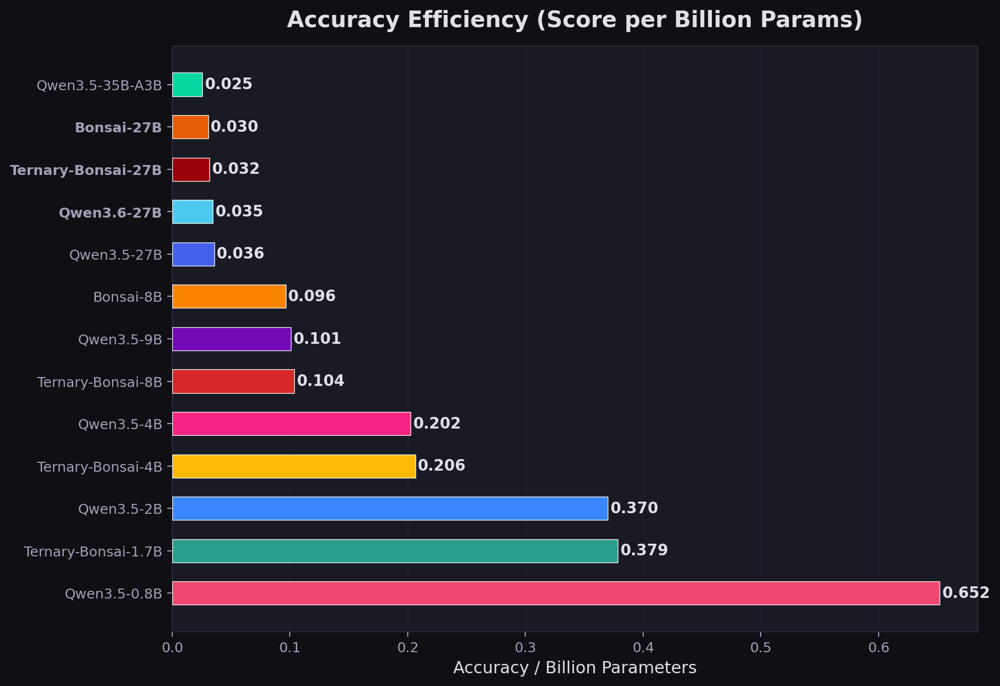

### Question-Level Analysis

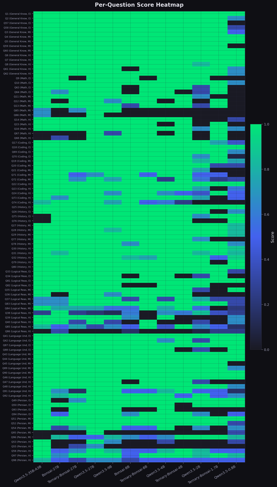

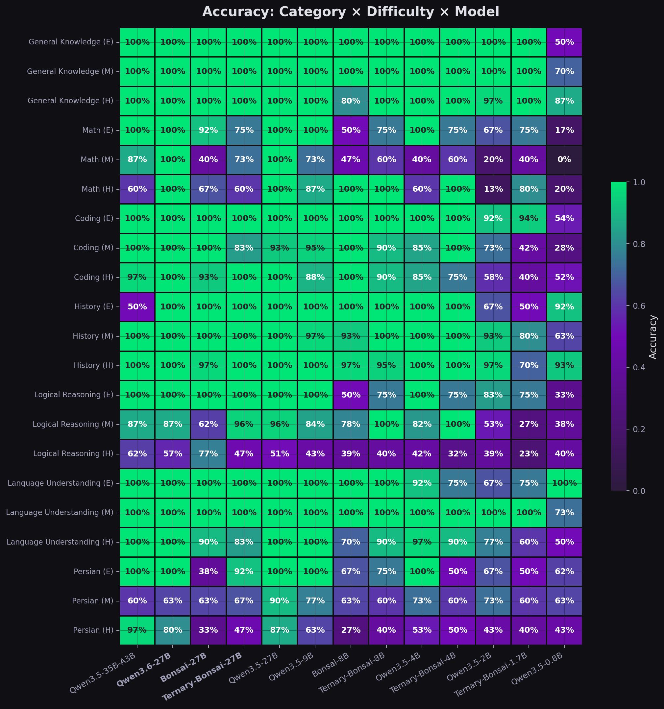

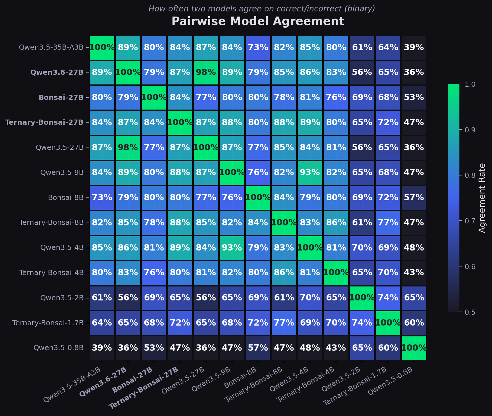

### Hardest Questions

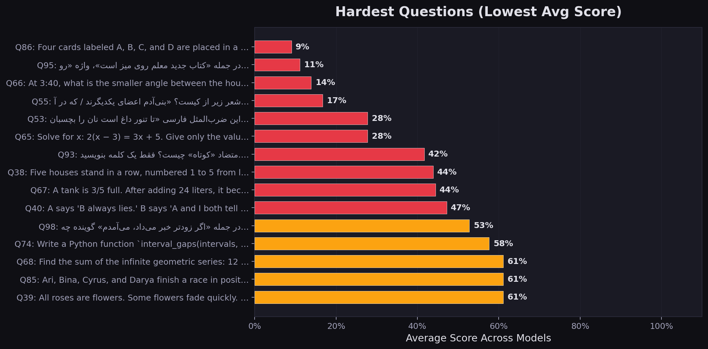

The hardest questions across all twelve models remain the logic constraint puzzles (card ordering, clock angles, race ordering) and Persian language tasks. These require precise multi-step reasoning or strong multilingual knowledge — areas where smaller / more-quantized models struggle most. With 12 models now in the field, questions that Qwen3.5-27B aces but the 1.7B / 0.8B (and, on Persian, the 1-bit Bonsai-27B) get wrong reveal the minimum model capacity — and the minimum bit-width — required for each task.

### Verbosity

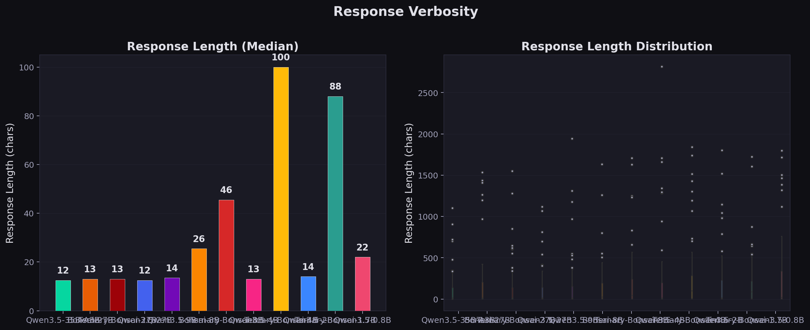

## Key Takeaways

1. **Qwen3.5-27B is still the accuracy leader** at 95.7%. At 9.5 tok/s it's the slowest — best when correctness dominates latency.

2. **Ternary-Bonsai-27B is the new Bonsai-family accuracy ceiling** — 86.2%, narrowly the best of all six Bonsai models, edging Ternary-Bonsai-8B (85.0%) and Qwen3.5-4B (85.2%). But scaling ternary from 8B to 27B adds only ~1 point overall: the family's accuracy has largely plateaued, and the ≥90% Qwen tier stays out of reach.

3. **At 27B, ternary clearly beats 1-bit** — Ternary-Bonsai-27B (86.2%) tops Bonsai-27B (82.9%) by 3.3 points, driven almost entirely by **Persian (+21.5)** and math (+4.7). The 1-bit model even *trails the 8B ternary model* overall. Extra bits matter more than extra parameters for the capabilities Q1_0 damages.

4. **1-bit quantization's damage is multilingual, and size doesn't fix it** — Bonsai-27B scores just 45.2% on Persian, the *worst* of any Bonsai model, despite being the largest. General knowledge, coding, and history all survive Q1_0 essentially intact (100% / 97.6% / 98.8%); Persian and math are where the bits are missed.

5. **Q1_0 is now upstream; Q2_0 CUDA needs the fork.** Mainline llama.cpp runs Bonsai-27B's `Q1_0` on GPU with a stock build — no PrismML fork required anymore. Upstream `Q2_0` is group-64 and CPU/Metal-only; Prism's group-128 `Q2_0` **CUDA** kernels live in the [PrismML fork](https://github.com/PrismML-Eng/llama.cpp), which is what gives Ternary-Bonsai-27B a real GPU path (13.7 gen / 94 prompt tok/s).

6. **On llama.cpp CUDA, model size — not runtime immaturity — sets the 27B speed.** Both 27B models run at ~14 tok/s, the expected memory-bandwidth cost of a 27B on a 205 GB/s bus. Their prompt processing (83–94 tok/s) actually *beats* the MLX Ternary-Bonsai-8B's (20 tok/s), so the larger 27B ternary finishes the full run faster (336 s) than the MLX 8B (714 s).

7. **Ternary-Bonsai-8B remains the standout mid-size entry** — 85.0% closes most of the Bonsai-8B → Qwen3.5-4B gap, with the biggest wins in math (+12) and logic (+16) over Bonsai-8B.

8. **The efficiency story lives at the small end.** Ternary-Bonsai-1.7B is the accuracy-per-byte champion (1.44 acc/GiB from 462 MiB); the 27B models are the worst per byte (0.13–0.23) — they are the maximum-accuracy Bonsai play, not the efficient one.

9. **MLX-CUDA on Jetson is still much slower than llama.cpp** for the same-scale model — an early-stage backend on sm_87, not a property of the weights. On Apple Silicon the same MLX models run several times faster.

10. **Coding survives quantization down to ~4B** — Bonsai-27B 97.6%, Ternary-Bonsai-27B 94%, Ternary-Bonsai-8B 93%, 4B 91%, Bonsai-8B 100%. Below ~4B it collapses (1.7B=56%, 0.8B=44%).

11. **The original Bonsai-8B remains the latency champion** in its accuracy bracket. Via llama.cpp's Q1_0 it runs at 46.5 tok/s with 554 tok/s prompt — nothing else in the ≥78% accuracy group comes close on throughput on this hardware.

## Bonsai-8B vs Ternary-Bonsai-8B: Q1_0 llama.cpp vs mlx-2bit MLX-CUDA

Two ways to aggressively compress the same 8B Qwen3 architecture — which one works on the edge?

| | Bonsai-8B (Q1_0, llama.cpp) | Ternary-Bonsai-8B (mlx-2bit, MLX-CUDA) |
|---|:-:|:-:|
| Weight size | **1.1 GiB** (1-bit) | 2.1 GiB (~1.58-bit ternary, 2.13 bits/weight effective) |
| Overall accuracy | 78.9% | **85.0%** (+6.1 pts) |
| General Knowledge | 92.9% | 100% |
| Math | 66.7% | 78.6% |
| Coding | 100% | 92.9% |
| History | 96.4% | 98.2% |
| Logical Reasoning | 55.9% | 71.4% |
| Language Understanding | 89.3% | 96.4% |
| Persian | 51.2% | 57.1% |
| Gen tok/s (Jetson) | **46.5** | 15.0 |
| Prompt tok/s (Jetson) | **554** | 20 |
| Full-benchmark wall time | **117 s** | 714 s |

**Accuracy:** Ternary weights win almost everywhere. The big deltas are in reasoning-heavy categories — math (+12), logical reasoning (+16), language understanding (+7). The one category where Bonsai-8B's Q1_0 beats it is coding (100% → 92.9%), though that's a 1-question swing on a 14-question slice. Net: at a cost of 1 GiB more disk, Ternary-Bonsai-8B buys you roughly the accuracy of a dense Qwen3.5-4B.

**Throughput:** Bonsai-8B wins convincingly on this Jetson — 3× generation speed, 27× prompt speed, 6× faster end-to-end. But that's a runtime story (heavily optimized llama.cpp CUDA vs. a brand-new MLX CUDA backend on sm_87), not a model-architecture story. On Apple Silicon, the same `mlx-2bit` Ternary-Bonsai-8B is reported at ~30 tok/s on an M4 Pro; the Ternary-Bonsai-1.7B is listed at 103 tok/s on an iPhone 17 Pro Max. The ceiling on Jetson-MLX is an engineering problem, not a quantization one.

**Bottom line:** On today's Jetson, Bonsai-8B Q1_0 is the pragmatic choice if you need throughput and can live with ~79% accuracy. Ternary-Bonsai-8B is the pragmatic choice when accuracy matters more than tok/s, and becomes the dominant choice the moment the MLX-CUDA backend catches up to llama.cpp's kernel maturity. On Apple Silicon, Ternary-Bonsai is already the better option on all axes.

## Bonsai-27B vs Ternary-Bonsai-27B: Q1_0 vs Q2_0 ternary, both on llama.cpp CUDA

The same two-way question, one scale up — and this time **both** models are GGUF running on the Jetson GPU through llama.cpp, so the comparison is clean of any runtime asymmetry.

| | Bonsai-27B (Q1_0, upstream llama.cpp) | Ternary-Bonsai-27B (Q2_0_g128, PrismML fork) |
|---|:-:|:-:|
| Weight size | **3.5 GiB** (~1.1-bit) | 6.7 GiB (~2.1-bit ternary effective) |
| Overall accuracy | 82.9% | **86.2%** (+3.3 pts) |
| General Knowledge | 100% | 100% |
| Math | 64.3% | **69.0%** |
| Coding | **97.6%** | 94.0% |
| History | 98.8% | **100%** |
| Logical Reasoning | 78.2% | **79.5%** |
| Language Understanding | **96.4%** | 94.0% |
| Persian | 45.2% | **66.7%** |
| Gen tok/s (Jetson) | **14.7** | 13.7 |
| Prompt tok/s (Jetson) | 83.1 | **94.3** |
| Full-benchmark wall time | 425 s | **336 s** |
| Runtime | mainline llama.cpp (CUDA) | PrismML fork (CUDA) |

**Accuracy:** Ternary wins the aggregate by 3.3 points, but the split is lopsided by category. It's essentially **one category — Persian (+21.5)** — plus a math edge (+4.7) that carries the difference; the two models are within a point on GK, logic, and history, and the 1-bit model actually *wins* coding (+3.6) and language (+2.4). The takeaway from the 8B comparison holds and sharpens: 1-bit quantization's damage is concentrated in multilingual and arithmetic, and a bigger backbone does **not** repair it (Bonsai-27B's 45.2% Persian is the worst in the whole family). If your workload is English knowledge/coding, the 1-bit 27B at half the disk is remarkably close; if it's multilingual, the ternary model is the clear pick.

**Throughput:** Nearly identical (~14 tok/s gen) since both are 27B on the same 205 GB/s bus — and both are *honest llama.cpp CUDA numbers*, unlike the MLX Ternary models. The ternary model even edges prompt throughput (94 vs 83 tok/s) and finishes the full 98-question run faster (336 s vs 425 s), because Bonsai-27B, with thinking off, still tends to emit slightly longer answers on this set.

**Bottom line:** Ternary-Bonsai-27B is the better all-round 27B Bonsai and the family's accuracy leader, but it's a big file for what it buys — 1.2 points over the 8B ternary at 3× the disk. Bonsai-27B is the more interesting engineering result: a genuinely 1-bit 27B that holds 100% GK, 98.8% history, and 97.6% coding, running on **stock upstream llama.cpp** — its only real weakness is anything multilingual.

## Running

```bash
# Run the full benchmark (all 12 models)
uv run llm_benchmark.py

# Run specific models only
uv run llm_benchmark.py qwen3.5-2b qwen3.5-0.8b qwen3.5-35b-a3b
uv run llm_benchmark.py ternary-bonsai-1.7b ternary-bonsai-4b ternary-bonsai-8b
uv run llm_benchmark.py bonsai-27b ternary-bonsai-27b

# Generate analysis plots
uv run benchmark_eda.py
```

Requires passwordless sudo for `systemctl start/stop llama-server-*` (see `/etc/sudoers.d/llama-benchmark`). The existing sudoers rule matches `llama-server-*`, which covers the llama.cpp Qwen/Bonsai units, the MLX `llama-server-ternary-bonsai-{1.7b,4b,8b}.service` units, and the two new 27B units `llama-server-bonsai-27b.service` / `llama-server-ternary-bonsai-27b.service`.

### Running the 27B GGUF models

Both 27B models are GGUF served through `llama-server`, with thinking disabled (`LLAMA_CHAT_TEMPLATE_KWARGS={"enable_thinking":false}` + `--reasoning off`) so they answer directly under the benchmark's small token budgets:

- **Bonsai-27B** (`Q1_0`) runs on **mainline llama.cpp** — `Q1_0` (1-bit, type 41) is upstreamed and has CUDA kernels, so a stock `-DGGML_CUDA=ON` build serves it on the Jetson GPU with `-ngl 99`.
- **Ternary-Bonsai-27B** (`Q2_0`) needs the **[PrismML fork](https://github.com/PrismML-Eng/llama.cpp)** for GPU. Upstream `Q2_0` is group-64 and CPU/Metal-only; the fork's `prism` branch adds group-128 `Q2_0` **CUDA** kernels (and keeps `qwen35` arch support), so we serve the `Ternary-Bonsai-27B-Q2_0.gguf` (g128) file through the fork with `-ngl 99`. The upstream-compatible `Q2_g64.gguf` file loads on mainline but only on CPU (~2 tok/s) — the fork's g128 CUDA path is ~7× faster (13.7 tok/s).

### MLX-CUDA setup on Jetson (for Ternary-Bonsai)

The three `mlx-2bit` Ternary-Bonsai models are served by `~/ai/test-mlx-on-cuda/mlx_openai_server.py`. The runtime needs a source-built MLX with sm_87 kernels, a newer cuDNN than the system one, and an env flag to disable cuDNN SDPA (which has no execution plan on sm_87). Once the `.venv` is set up, the systemd units pick it all up automatically. The key knobs:

- `MLX_CUDA_ARCHITECTURES=87-real` at build time
- `LD_LIBRARY_PATH=.../nvidia/cudnn/lib` (pip wheel, cuDNN 9.21+)
- `MLX_CUDA_USE_CUDNN_SDPA=0` (force non-cuDNN SDPA)

## Hardware

- **Device:** NVIDIA Jetson Orin
- **Memory:** 30,696 MiB unified (shared CPU/GPU)
- **CPU:** 12 threads (ARM Cortex-A78AE)
- **GPU:** Ampere (compute capability 8.7)
- **Memory Bandwidth:** ~205 GB/s
- **CUDA:** 12.6 · **Driver:** 540.4.0 · **cuDNN:** 9.3 (system) / 9.21 (pip wheel, used by MLX)
- **MLX:** 0.31.1 built from source with `MLX_BUILD_CUDA=ON MLX_CUDA_ARCHITECTURES=87-real`
- **llama.cpp:** mainline b10013 (upstream, `-DGGML_CUDA=ON -DCMAKE_CUDA_ARCHITECTURES=87`) for Bonsai-27B `Q1_0`; [PrismML fork](https://github.com/PrismML-Eng/llama.cpp) `prism` branch (b9591) for Ternary-Bonsai-27B `Q2_0_g128` CUDA

## Author

Arman Jafarnezhad w/ Claude Opus 4.6 Max Effort · Ternary-Bonsai MLX-CUDA run: Claude Opus 4.7 (1M) · 27B GGUF run (Bonsai-27B & Ternary-Bonsai-27B): Claude Opus 4.8

## Citation

If you use this benchmark or build on its results, please cite it:

```bibtex
@software{jafarnezhad_bonsai_vs_qwen_2026,
  author  = {Jafarnezhad, Arman},
  title   = {Bonsai vs Qwen3.5 on Edge: Benchmarking Aggressively Quantized LLMs on NVIDIA Jetson Orin},
  year    = {2026},
  url     = {https://github.com/ArmanJR/PrismML-Bonsai-vs-Qwen3.5-Benchmark},
  version = {2026.07.14}
}
```
